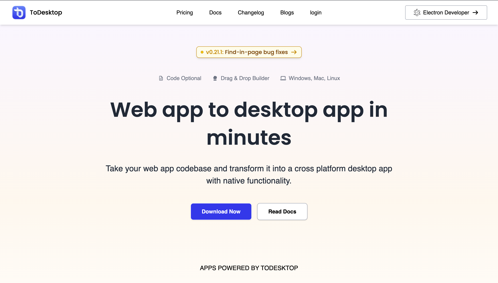

# 🚀 Tailwind Landing Page

A responsive ToDesktop Landing Page Clone inspired by the official ToDesktop website. This project was built to practice modern frontend development using Tailwind CSS and JavaScript while recreating a real-world production UI.

## 📸 Screenshot



---

## ✨ Features

- Responsive design for desktop, tablet, and mobile
- Modern UI built with Tailwind CSS
- Mobile navigation menu
- Animated scrolling sections
- Interactive FAQ accordion
- Pricing section
- Enterprise section
- Footer with responsive layout
- Smooth animations and transitions

---

## 🛠️ Technologies Used

- HTML5
- Tailwind CSS
- JavaScript (ES6)
- Font Awesome

---

## 📁 Project Structure

```
Landing-Page/
│
├── assets/
├── assets-2/
├── src/
├── index.html
├── script.js
├── package.json
└── README.md
```

---

## ⚙️ Installation

Clone the repository

```bash
git clone https://github.com/ShriyanshPandey-702/Landing-Page.git
```

Go to the project folder

```bash
cd Landing-Page
```

Install dependencies

```bash
npm install
```

Run the project

```bash
npm run dev
```

---

## 📌 Future Improvements

- Dark Mode
- Better animations
- More accessibility improvements
- Performance optimization

---

## 👨‍💻 Author

**Shriyansh Pandey**

GitHub: https://github.com/ShriyanshPandey-702